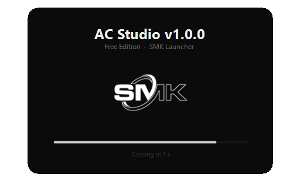
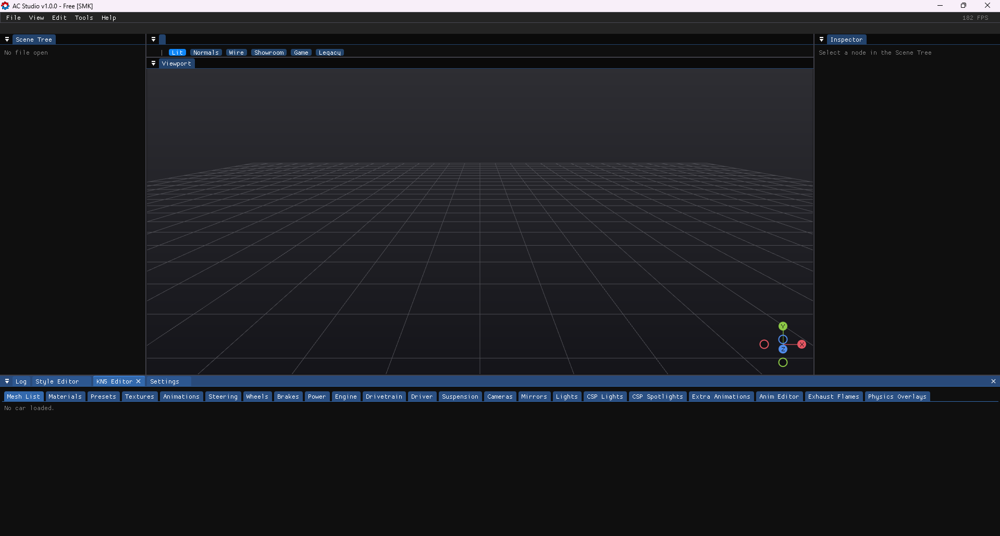

<div align="center">


# SMK Launcher — AC Studio

**The community launcher for AC Studio — open it, create, ship your mod.**

[](https://l3g3nd2410.github.io/SMKLauncher-AC-Studio/)
[](https://github.com/l3g3nd2410/SMKLauncher-AC-Studio/releases)
[](https://github.com/l3g3nd2410/SMKLauncher-AC-Studio/releases/latest)
[](https://github.com/l3g3nd2410/SMKLauncher-AC-Studio/releases)
[](https://github.com/l3g3nd2410/SMKLauncher-AC-Studio)

</div>

---

## What is SMK Launcher?

**SMK Launcher** is a lightweight, community-built launcher for **AC Studio** — It handles setup automatically so you can open the editor and start working immediately, without any configuration steps.

Built by and for the Assetto modding community.

---

## Features

- **One-click launch** — double-click and AC Studio opens, fully configured
- **Non-destructive** — operates on a separate working copy; your original `AC Studio.exe` is never modified
- **Auto-cleanup** — the working copy is deleted automatically when AC Studio closes
- **Splash screen** — minimal dark UI shows progress on launch
- **Version detection** — reads the AC Studio version and displays it in the window title
- **Tiny** — ~200 KB, no installer, no admin rights needed

---

## Screenshots

<div align="center">

| Splash Screen | AC Studio (running) |
|:---:|:---:|
|  |  |

</div>

---

## Download

→ **[Latest Release](https://github.com/l3g3nd2410/SMKLauncher-AC-Studio/releases/latest)**

| File | Description |
|---|---|
| `SMKLauncher.exe` | Place it in the same folder as `AC Studio.exe` and run it |

### Requirements

- Windows 10 or 11 (64-bit)
- [.NET 8 Desktop Runtime (x64)](https://dotnet.microsoft.com/en-us/download/dotnet/8.0/runtime)
- `AC Studio.exe` in the same folder as the launcher
- **AC Studio** → [Download here](https://tinyurl.com/AC-Studio)

> If the download link is unavailable, open an [Issue](https://github.com/l3g3nd2410/SMKLauncher-AC-Studio/issues) and we'll update it.

---

## Installation

```
1. Download SMKLauncher.exe from the Releases page
2. Drop it into the same folder as AC Studio.exe
3. Double-click SMKLauncher.exe
4. Done — AC Studio opens
```

The launcher auto-detects `AC Studio.exe` in its own directory. No configuration file, no registry entries.

https://github.com/user-attachments/assets/891b68ab-8c6f-4610-ae95-ecf6b7eb0d77

---

## How It Works

```
Your folder
├── AC Studio.exe        ← original, never touched
└── SMKLauncher.exe      ← run this

At launch:
  1. SMKLauncher copies AC Studio.exe → hidden temp file
  2. Configures the working copy
  3. Launches it
  4. Waits for you to close AC Studio
  5. Deletes the temp file
```

The original `AC Studio.exe` is read-only from the launcher's perspective — it is **never written to**.

---

## AC Studio & Related Tools — Community Overview

If you're getting into Assetto modding, here's the landscape:

| Tool | Use case | Notes |
|---|---|---|
| **AC Studio** | Cars, tracks, animations, textures | Full-featured modern GUI, community-built, the go-to for most modders |
| **KS Editor** | Cars, tracks, animations, textures | Official Kunos editor, older, free — predecessor to AC Studio |
| **Content Manager** | Launcher, showroom, mod management | Essential community replacement for the default AC launcher |
| **Blender + AC Tools** | 3D modeling — KN5 / KSANIM | Import and export KN5 and KSANIM directly from Blender |
| **3DSimED** | KN5 editing, texture extraction | Open and edit KN5 files, export to FBX for further editing |
| **Custom Shaders Patch** | Graphics and physics extensions | Community patch adding rain, dynamic lighting, improved physics |

> SMK Launcher lowers the barrier to entry for AC Studio so new modders can get started quickly.

---

## Frequently Asked Questions

**Q: Does this touch or modify my AC Studio.exe?**
No. The launcher only reads the original file to make a copy. It writes to the copy, not the original.

**Q: Do I need to reinstall the launcher after AC Studio updates?**
Usually no. The launcher checks the version on each run and adapts. If a major update changes the editor's internals, a launcher update may be needed.

**Q: Is this compatible with KS Editor projects?**
AC Studio supports the same project formats as KS Editor in most cases. Check AC Studio's documentation for format compatibility.

**Q: Will this work on Windows 10?**
Yes — Windows 10 64-bit and Windows 11 are both supported.

**Q: Can I run the original AC Studio without the launcher?**
Yes, the launcher is entirely optional. It doesn't change anything about AC Studio itself.

---

## Contributing

Issues and pull requests are welcome.

- **Bug reports** → [Open an issue](https://github.com/l3g3nd2410/SMKLauncher-AC-Studio/issues)
- **Questions** → [Discussions](https://github.com/l3g3nd2410/SMKLauncher-AC-Studio/discussions)

---

## Legal Notice

SMK Launcher is an independent community tool. It does not distribute, bundle, reproduce, or permanently modify any third-party software. It operates exclusively on files already present on the user's own system, creating a temporary working copy that is deleted at the end of each session.

Users are solely responsible for ensuring that their use of AC Studio complies with its terms of use. SMK Launcher is not affiliated with, endorsed by, or connected to the developers of AC Studio or KS Editor.

This project is provided as-is, for educational and community modding purposes.

---

<div align="center">

Made with ♥ for the Assetto modding community &nbsp;·&nbsp; **SMK Team**

</div>
